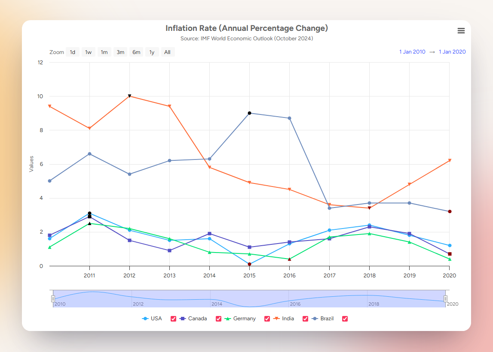

<h1 align="center">
    Interactive Economic Data Visualization
</h1>

    

***

**Interactive Economic Data Visualization** is an application that accepts datasets in the form of JSON files and enables users to visualize data in an interactive graphical interface.

Datasets utilize the Highcharts JavaScript library to explore changes in values over time with options to configure filters and ranges before exporting data to a file.

JSON files, application source files, and the webpack module bundler output are served through an http server using the express.js web framework. Frontend assets are built using Bootstrap's responsive elements and React UI components.

***

&nbsp;

# Quick Links

- Website: https://oyster-app-kxqwh.ondigitalocean.app/
- Economic data: https://www.imf.org/en/Publications/WEO/weo-database/2024/October/download-entire-database
- Highcharts Stock: https://www.highcharts.com/products/stock/
- React: https://react.dev/
- Bootstrap: https://getbootstrap.com/ 
- Express.js: https://expressjs.com/
- Webpack: https://webpack.js.org/
- Babel: https://babeljs.io/
- Node.js: https://nodejs.org/

&nbsp;

# Installation

&nbsp;

# License
- [MIT License](https://github.com/wgbcamp/economic-data-visualization/blob/main/LICENSE)
